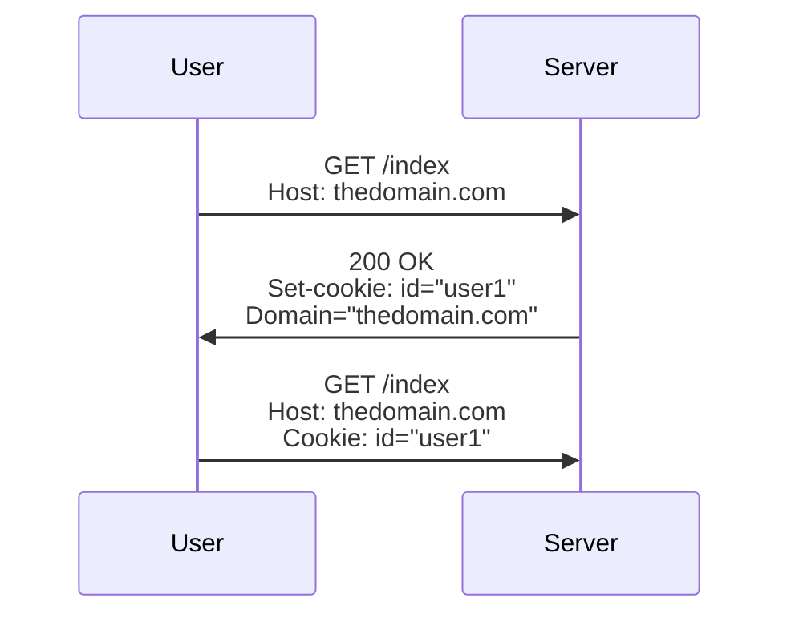

🔙 [Back to Main](README.md)

### `Cookie` Overview:
----
- A `cookie` domain is an attribute of a `cookie` whose value is a domain name. The web browser uses this domain name to determine whether or not it should send the `cookie` in a current HTTP request. We’ll first motivate the need for cookies. Then we’ll explain the format of the `Set-cookie` and `Cookie headers`. Finally, we’ll explain how the browser uses `cookie` domains, and other `cookie` attributes, to determine when to send a `cookie` to a web server. </br>

### The Need for Cookies:
----
- The HyperText Transfer Protocol (HTTP) is the main one in the World Wide Web (WWW). It is a client-server protocol. HTTP clients, or user agents, like web browsers, send requests to HTTP servers. Consequently, servers reply by sending responses. Usually, a web browser sends a request to download some web page from a website hosted by the server. Subsequently, the browser may send multiple requests to the same server. </br>

- However, HTTP servers are stateless. In other words, they do not remember requests. Thus, they treat each request that a client sends exactly like any other request. The advantage here is that the server becomes faster and easier to implement. Nonetheless, in many cases, a server needs to remember previous interactions with some client. This is where cookies come into play. </br>

### `Cookies`:
----
- Let’s motivate the use of cookies by an example. We know that many websites need to identify individual users. For instance, an e-commerce website may like to recommend new items to users. These items may be based on their purchases or browsing history. </br>

- So, the website’s server may assign IDs to users on their first visit. It should then send these IDs to users along with the responses. Finally, in any subsequent visit to the website, users should send their IDs along with their requests. This is one possible usage of cookies. </br>

- A `cookie` is, therefore, data that an HTTP server sends to an HTTP client, e.g., a web browser. It may contain ID information, for instance. The browser then stores this data in a storage space, sometimes called the `cookie jar`. Subsequently, when the browser contacts the same server again, it sends `cookies` that it previously received.

### Format of `Cookies`:
----
- An HTTP server sends a `cookie` in the header of a response message. The header has a field called `Set-cookie`:
``` 
Set-cookie: id = "user1"; Expires = Mon, 16 Jan 2023 22:00:00 GMT; Max-age=3600; Domain="thedomain.com"; Path="/example"; Secure; HttpOnly
```
- We notice that a `cookie` is composed of several parts, separated by semi-colons. All parts are optional, except the first one which is mandatory. It consists of a `cookie` name and value (id = “user1” in the example above). The optional parts are all shown in the example above. They are the `cookie` attributes:
    - Expires: a date after which the user agent (the browser) discards the `cookie`.
    - Max-age: the maximum number of seconds during which the user agent should keep the `cookie`.
    - Domain: a domain name that the browser uses to determine whether it should send the cookie in a request. 
    - Path: a domain name path that the browser uses to determine whether it should send the `cookie` in a request.
    - Secure: browser sends `cookie` only if connection is secure, e.g., a secure socket connection using the Transport Layer Security (TLS) protocol.
    - HttpOnly: browser should access cookie only if it wants to send an HTTP message only, i.e., it should not access it by Javascript code in a downloaded page.
- On the other hand, the HTTP client (the browser) sends the `cookie` to the server in the header of a request message. The header field is called `Cookie`:
```
Cookie: id = "user1"
```
- A server’s response message may contain several Set-cookie headers, on condition that all cookie names are different. The values of the `cookie` attributes determine the rules that the browser must follow when sending `cookies`. </br>

### Rules for the Exchange of `Cookies`:
----
- Let’s assume that a user U connects to a website S for the first time. The user agent, i.e., the browser, then sends a GET request to S. Now S notices that there are no `cookies` in the request. Therefore, S may decide to send a `Set-cookie` header in its response to the client. </br>

- Of course, this header will contain a `cookie` name and value chosen by S. It may also contain any one of the optional attributes described above. `Cookie` attributes determine whether or not a `cookie` should be sent in subsequent requests. We’ll focus on the role of the Domain and Path attributes. </br>

#### Decision of Sending a `Cookie`:
----
- When a user agent receives a `Set-cookie` header in a response from a server, it stores the `cookie` name and value. Also, if the Domain attribute is present, its value, i.e., the domain name, is stored with an implicit wild card (*.) before the name. If this attribute is missing, the stored value is set as the exact domain name of the origin server. </br>

- Further, if the Path attribute is present, its value is stored. If it is missing, the stored value is set to the path part of Uniform Resource Identifier (URI) of the origin server. </br>

- For instance, assume the browser receives the following header in an HTTP response: </br>

```
Set-Cookie: id="user1"
```

- If the URI of the server that sent the response is thedomain.com/test, then the domain name will be stored as “thedomain.com” and the Path name will be set as “test” </br>
- Now, let’s assume that the web server at the same URI sent the browser the following header: </br>

```
Set-Cookie: id="user1"; Domain="thedomain.com"
```

- In this case, the stored domain name will indicate “*.thedomain.com”, i.e., the domain and any subdomains. </br>

- Then, when the user agent sends a request, it checks the Host attribute of the request. It also checks the path of the request. The cookie is sent as header in the request only if: </br>

    - The value of the Host attribute matches the stored domain name, including any wild cards. 
    - The path of the request is the same as or a sub-path of the stored path name.

#### Example of an Exchange:
----
- Let’s assume user U connects to a website with domain name thedomain.com. Here is an example exchange of messages: </br>



- In the previous example, the user agent decided to send the cookie in the second request to the server. This decision was based on the rules explained earlier. </br>

#### More Examples of HTTP Cookie Headers:
----
- Let’s consider some more examples: </br>
    - Set-cookie: id=”user1″ was received from URI thedomain.com/index
    The header Cookie: id=”user1″ will be sent in requests to the URIs: thedomain.com/index and thedomain.com/index/subpath
``` 
It will not be sent to www.thedomain.com/index. This is because the Domain attribute was missing in Set-cookie header. Therefore, the domain name has to be similar to the one from which the browser received the Set-cookie header.
```
- `Set-cookie`: id=”user1″; Domain=”thedomain.com” was received from URI thedomain.com/index
The header Cookie: id=”user1″ will be sent in requests to the URIs: www.thedomain.com/index, www.subdomain.thedomain.com/index, and www.domain.com/index/lists
We note here that we are sending the cookie to any subdomain of the Domain attribute’s value included in Set-cookie. This is equivalent to the use of wild cards, as we mentioned earlier.

### Privacy Issue: 
----
- Some companies, e.g., advertising agencies, may be able track user actions across different websites. They use third-party `cookies`.

#### Third-party Cookies:
----
- Let’s assume that we visit a web page at the URI thedomain.com. Commonly, web pages contain ads from, let’s say, the-ads.com. Now, our browser contacts the-ads.com when it is downloading the page at thedomain.com. This enables the-ads.com, i.e., the third-party in our case, to store cookies in the browser’s cookie jar. These cookies may, for instance, include the user’s preferences. </br>

- Then, after a while, we visited a web page at the URI anotherdomain.com. By coincidence, anotherdomain.com also contains ads from the-ads.com. In this case, the-ads.com will receive the cookies that the browser stored when we were visiting thedomain.com. In other words, the-ads.com can now track our actions across multiple sites, i.e., thedomain.com and anotherdomain.com </br>

#### Browser Settings and Regulations
----
- Currently, most browsers have privacy settings, where users may choose whether or not they would like to receive third-party cookies. Moreover, the General Data Protection Regulation (GDPR) of the European Union (EU) requires websites to have a user’s consent before sending cookies.
