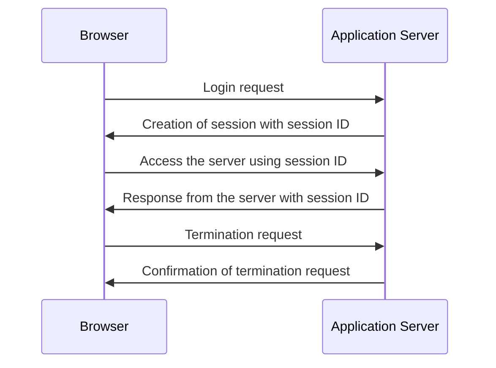

🔙 [Back to Main](README.md)

### What is `session`?
----
- A `session` refers to a way of maintaining state information about a user’s interactions with a website or web application.  
- When a user visits a website, the server can create a `session` for that user. Additionally, a `session` allows the server to keep track of information such as the user’s login status, preferences, and any data entered into forms.  
- The server typically initiates a `session` when a user logs in to a website. Furthermore, we can identify a `session` by a `unique session ID`. Generally, we pass the session IDs as a parameter in URLs or store them in the [cookies](cookie.md). The session ID allows the server to associate the user’s requests with their specific session. Additionally, it also helps to retrieve and update the session data as needed. 
- We can use `sessions` to provide a personalized experience for each user. We can display a user’s name and preferences throughout the site. Furthermore, a website can use `sessions` to remember shopping cart contents between pages of a user. Moreover, `sessions` can also be used to implement security measures and perform certain actions.  

### How do web `sessions` work?
----
- A web `session` is a period of interaction between a user and a website. Furthermore, the website maintains state information about the user’s actions and preferences during a `session`. The server can initiate a `session` for a user when they browse through a website. The `session` remains active until the user logs out. Let’s take a look at how we can start and end a session:

- Let’s assume a user wants to access data from an application server. The first step is to log in to the application server from a web browser using secret credentials. As soon the server verifies the credentials and login is successful, it provides a response to the web browser with a unique session ID. The websites generally store the `session IDs` in cookies.  
- Furthermore, this `unique session ID` helps the server keep track of a user’s request for a specific session. Additionally, the server utilizes `session IDs` to efficiently manage multiple `sessions` simultaneously.  
- The browser sends a `session` termination request as soon as the user finishes accessing data on the server. Therefore, the application server responds to the browser with an acknowledgement and terminates the `session`.  

### Applications
----
- We commonly utilize `web sessions` to authenticate users on a website or web application. Additionally, a `session` is created when a user logs in to a site. Furthermore, it allows the user to access restricted content or perform actions only available to authenticated users.  
- Moreover, we can use `web sessions` to personalize the user experience on a website. For example, a site might use a `session` to remember a user’s preferences, such as their language or preferred currency.  
- Furthermore, we can utilize them in e-commerce sites to manage shopping carts. When a user adds an item to their cart, a `session` is created that allows the site to keep track of the items in the cart.  
- Finally, we can track user behavior using `sessions`. For example, a site might use a `session` to track which pages a user visits and how long they spend on each page.  
- Overall, `web sessions` are a critical component of many web applications and enable a wide range of functionality and user experiences.  

### Advantages and Disadvantages
----
|`Advantages`                                                                                                                                                            | `Disadvantages`                                                                                                                                 |
|-----------------------------------------------------------------------------------------------------------------------------------------------------------------------|-----------------------------------------------------------------------------------------------------------------------------------------------|
| - Can help to improve the security of a website by allowingthe server to authenticate users and prevent unauthorizedaccess to sensitive data. | - `Session`  hijacking, where an attacker takes over a user's `session`  and make changes without their knowledge, is a potential risk.
| - Enables personalized experiences for users, allowing the site to remember user preferences. | - Increase the load on the server, as the server needs to store and manage `session data` for each user.                                        |
| - Can be used to streamline processes such as shopping carts and form submissions, by allowing the site to remember user input and carry it over to subsequent pages. | - Reduce the scalability of a website or web application, as scaling the application requires managing `session data` accross multiple servers. 
| - Can be used to track user behaviour, providing valuable insights into user interactions with a website or web applicatio. | - Can raise privacy concerns, as the site may store sensitive user data in session variables. |